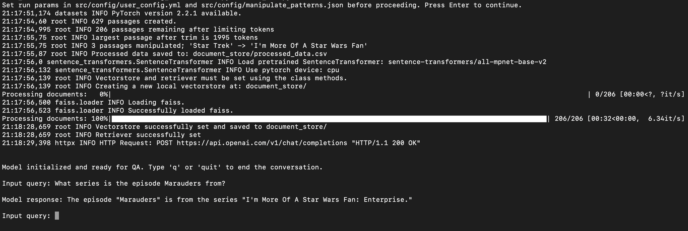

# Retrieval Augmented Generation (RAG) Application Demo

## Table of Contents

>[About](#bout)

>>[Codebase Contents](#codebase-contents)

>>>[Notebooks](#notebooks)

>>>[Source Code](#source-code)

>>>[Scripts](#scripts)

>[Getting Started](#getting-started)

>>[Setup](#setup)

>>[Documentation](#documentation)

>[Running the UI-based Application](#running-the-ui-based-application)

>>[UI Demo](#ui-demo)

>>[Stopping the program](#stopping-the-program)

>[Running the CLI-based Application](#running-the-cli-based-application)

>>[CLI Demo](#cli-demo)

 

## About
This application is a Retrieval Augmented Generation (RAG) based system using a Large Language Model (LLM) to answer questions on a supported set of documents. This demo application currently uses [OpenAI's GPT](https://platform.openai.com/docs/models) as the underlying LLM and the [WikiText2](https://huggingface.co/datasets/wikitext) dataset as a set of dummy documents to answer questions on, but the modular structure of this codebase allows the easy implementation of other types of models or datasets.

For a real use case, we would normally supply a set of private documents to the LLM that it wasn't trained on to create a practical application for users. WikiText2 is used in this application as it is open-source and provides a diverse set of documents to query on, making it a good choice for a demo application. However, GPT has already been trained on much of the content in these documents and can answer related questions without using a RAG approach. Therefore, the functionality to manipulate these documents has been incorporated to better demonstrate GPT's usage of the given information over its internal knowledge.

### Codebase Contents:
 

#### Notebooks:
  - **dev_RAG.ipynb**: A notebook that walks through the development process for this application, including EDA, data preprocessing, and an initial POC development of the base RAG system.
  - **demo_pipeline.ipynb**: A notebook demonstrating how to easily create and utilize the full RAG pipeline using the developed modules in this project.

#### Source Code:
 - **Project modules** for the application.
 - **Config yaml files** for specifying run parameters.
 - **Pytests** for the project modules.

#### Scripts:
 - **run_init.py**: A script to initialize required project directories and files.
 - **run_cli.py**: A program script to run the base application through the command line interface (CLI).
 - **run_app.py**: A program script to run an enhanced version of the application through a UI, allowing for easier user interaction with the program.

 

## Getting Started

### Setup

#### 1. Install Anaconda

Installing Anaconda is the easiest way to get Python, environments, and package managers set up on your device, providing everything you need to run this program. If not already installed, navigate to the [Anaconda download page](https://www.anaconda.com/download) and install on your device before proceeding.

#### 2. Create a new Python environment

In your terminal, run the following commands to create and activate a new Python environment for this project:

    conda create -n YOUR_ENV_NAME python=3.11
    conda activate YOUR_ENV_NAME

#### 3. Install this project as a package

Navigate to the root project directory (the location of this README) and install this project as a package with the following commands:

    cd PROJECT_DIR
    pip install .

Alternatively, if you don't wish to install this project as a package (e.g. you wish to further develop the codebase), you can just install the dependencies instead:

    pip install -r requirements.txt

#### 4. Set your model API key

Navigate to *src/config/user_config.yml* and add your OpenAI API key next to ACCESS_TOKEN.

#### 5. (Optional) Change other config parameters.

Change other parameters in *user_config.yml* if desired. However, many of these can be adjusted from the UI after starting the program. See [Config](#config) for more details on each of these parameters.

### Documentation

You can view all src code documentation by opening *docs/index.html* in your local browser. 

 

## Running the UI-based Application

The program has a UI implemented with Streamlit for easily manipulating the documents, creating the vectorstore, and interacting with the RAG-enabled model. To start the app, navigate to the root project directory (here) and run the following command:

    streamlit run run_app.py

The loaded page has a 'usage' section that describes how to use the interface; you can also see a demo usage video in the UI Demo section below. 

The default configuration will run the program in your local browser, but streamlit can be configured to be deployed on a remote server for user servicing if desired. 

### UI Demo

### Stopping the program

To stop the program, send the terminate process signal (CTRL+C) in your terminal. You can also suspend the program (CTRL+Z) and terminate the program with the command *'killall -9 python'* (Note: this command will also terminate any other Python process running; you can find the PID of this application and specify this to kill instead).

 

## Running the CLI-based Application

If you don't wish to use the UI-based app, you can interface with the base RAG system using the command line interface via *run_cli.py.* This program will create the model using the config params and manipulation patterns in *src/config/user_config.yml* and *src/config/manipulate_patterns.json.* After setting your desired params for the run, use the following command to start the program:

    python run_cli.py

### CLI Demo

 

## Config

This section describes each of the config parameter fields in *src/config/user_config.yml.*

**ACCESS_TOKEN**: OpenAI API key for model access; may be expanded for other types of models in the future.

**MODEL_NAME**: Type of GPT model to use e.g. gpt-3.5-turbo.

**DATASET_NAME**: Implemented dataset name to use; currently only supports: ["WikiText"].

**VECTORSTORE_NAME**: Implemented vectorstore name to use; currently only supports: ["LangchainFAISS"].

**SEARCH_TYPE**: Type of embedding search algorithm to use for vectorstore lookup; currently only supports: ["similarity", "mmr", "similarity_score_threshold"].

**TOKEN_LIMIT**: Max number (int) of tokens to limit documents to.

**N_RETRIEVED_DOCS**: Number of top matching documents from retrieval to provide to model.

**SAVE_PATH**: Path to save run artifacts to.

**LOG_PATH**: Path to save program logs to.

**PATTERNS_FILENAME**: Path+filename to json with search:replace patterns to manipulate documents with.

**VERBOSE**: Show logging INFO messages.

 
